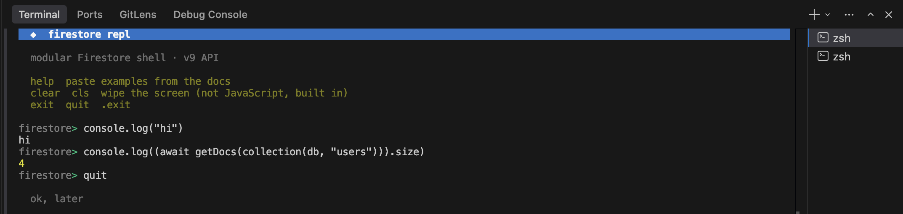

<div align="center">
<h1>firestore-repl</h1>

<p>Interactive Firestore REPL using the JS SDK. `index.js` has one example per CRUD op, and `repl.js` gives you a shell so you can try queries without touching files every time.</p>


</div>

## TOC

* [Before you run anything](#before-you-run-anything)
* [Scripts](#scripts)
* [index.js](#indexjs)
* [repl.js](#repljs)
  * [Using the REPL](#using-the-repl)
* [simple tutorial](#simple-tutorial)

---

## Before you run anything

1. Clone / open the project, then install deps:

   ```bash
   pnpm install
   ```

2. Copy `.env.example` to `.env` and fill the `FIREBASE_*` env vars. Same values as the Firebase web app config in the console. `firebase.js` reads them at startup so without them you’ll get a clear error listing what’s missing.

3. Create a Firestore database in the console if you haven’t...

---

## Scripts

**`pnpm start`** runs `node index.js`: by default the full `all` flow.

**`pnpm repl`** opens the interactive Firestore shell.

---

## index.js

Each op is a function (`createExample`, `readExample`, etc.) on the `users` collection.

```bash
# default: same as "all"
node index.js       

node index.js create

node index.js read

# first doc if you omit id
node index.js update

node index.js update <docId>

# first doc if you omit id
node index.js delete

node index.js delete <docId>

node index.js all
```

If you typo the mode, it prints usage and exits with code 1.

---

## repl.js

Run `pnpm repl` or `node repl.js`. You get a `firestore>` prompt. Type normal async JS that uses the Firestore helpers (`db`, `collection`, `addDoc`, `getDocs`, `query`, `where`, etc.) are already there, so you can paste stuff straight from the Firebase docs.

### Using the REPL

On launch it clears the terminal and shows a small header plus hint lines, nothing fancy.

**Built in words** (not JavaScript, the repl catches these before it tries to run code):

* `help` or `?` redraws that screen and adds an **examples** section underneath with a few snippets and short `#` comments above each one so you know what they’re for.
* `clear`, `cls`, `clc`, or the two words `clear screen` wipe the screen.
* `exit`, `quit`, or `.exit` quit the repl and close the Firestore connection.

**Actual JS:** your input runs inside an async function, so `await getDocs(collection(db, "users"))` and other Firestore calls work the way you’d expect. Paste from the docs and you’re usually fine. If you squash two statements onto one line, use a semicolon between them. Stuff like `cls` only works as the built in command above, it isn’t a global in Node.

**Multiline:** end a line with `\`, press enter, keep typing on the next line.

**Seeing results:** use `console.log(...)` when you care about printing, or make sure the last expression returns something, because the repl prints the return value with `util.inspect` when it isn’t `undefined`.

It's basically `eval` behind the scenes, so only run code you trust. Fine for your machine, bad for untrusted input!

That's it. If something breaks, check network, Firebase rules, and that `.env` matches the project you think you’re using.

---

## simple tutorial

Simple example you can paste in **`pnpm repl`** (all `await` because the repl runs your input as async code). Swap `users` / ids for whatever you use.

| What | Example |
|------|---------|
| Add a doc, id generated by Firestore | `await addDoc(collection(db, "users"), { name: "tester" })` |
| Set or overwrite one doc with a fixed id | `await setDoc(doc(db, "users", "somekey"), { name: "tester" })` |
| Read one doc | `console.log((await getDoc(doc(db, "users", "somekey"))).data())` |
| List every doc in a collection | `;(await getDocs(collection(db, "users"))).forEach((d) => console.log(d.id, d.data()))` |
| Update fields on a doc | `await updateDoc(doc(db, "users", "somekey"), { name: "renamed" })` |
| Delete a doc | `await deleteDoc(doc(db, "users", "somekey"))` |
| Query with a filter | `;(await getDocs(query(collection(db, "users"), where("name", "==", "tester"), limit(10)))).forEach((d) => console.log(d.id, d.data()))` |

If a line starts with `(` you may need a leading `;` so JavaScript doesn’t treat it as a call on the previous line. Same idea as in the browser console.
